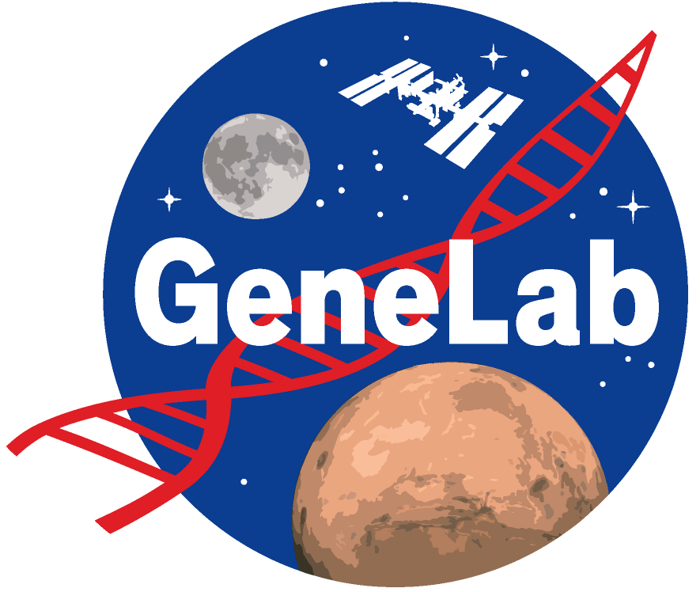

# OSDR Data Curation
## The [Open Science Data Repository (OSDR)](https://osdr.nasa.gov/bio/repo/) accepts all space-relevant data!

This includes (but is not limited to) data from the following types of experiments or studies:

1. Spaceflight
2. Parabolic or high-altitude flight
3. Altered gravity or gravitropism
4. Ionizing radiation
5. Hostile closed environments
6. Lunar or Martian regolith

 

## OSDR Metadata Templates
This repository holds the OSDR Sample and Assay metadata templates. 

**[Sample Metadata Templates](Sample_Metadata_Templates)**
- **[Spaceflight Studies](Sample_Metadata_Templates/Spaceflight_Studies)**: Templates for samples derived from spaceflight experiments (e.g. Space Shuttle, ISS, etc.)
- **[Ground Studies](Sample_Metadata_Templates/Ground_Studies)**: Templates for samples derived from space-analog experiments conducted on Earth (e.g. Ionizing radiation, Hypergravity, Simulated microgravity, etc.)

**[Assay Metadata Templates](Assay_Templates)**
- **[Omics Assay Templates](Assay_Templates/Omics_Assay_Templates)**: Templates for data derived from omics assays (e.g. RNA sequencing, Amplicon sequencing, Metagenomics, Methylation sequencing, etc.)
- **[Non-omics Assay Templates](Assay_Templates/Non-omics_Assay_Templates)**: Templates for data derived from physiological, phenotypic, and/or behavioral assays (e.g. Imaging, Calcium Uptake, Video recordings, Muscle contractility, etc.)

*If you would like to submit data to NASA's Open Science Data Repository (OSDR) but don’t see any studies similar to yours in the [OSDR repository]((https://osdr.nasa.gov/bio/repo/)) don’t be discouraged! Yours could be the first. Please email our curation team if you are unsure if your data is appropriate for the OSDR repository [arc-dl-osdr-help@mail.nasa.gov]*

 

---

### Are you ready to submit your data to OSDR?

If you are interested in submitting your data to OSDR but are unfamiliar with the repository please review the [OSDR data submission guidelines](https://genelab.nasa.gov/guidelines-data-submission-osdr). When you are ready to enter your sample and assay metadata, return to this repository to locate the correct [sample](Sample_Metadata_Templates) and [assay](Assay_Templates) metadata templates for your study. We have created several organism and assay specific templates to help you get your data into the format required to submit to OSDR. We encourage you to download the templates relevant to your study even if you have not yet begun to collect data. Each template includes tool tips, example rows, and drop down menus to help you understand what values are expected in each column.

> *Note: If you cannot find a template you are looking for, or if you have suggestions for how to improve an existing template please feel free to [create an Issue](https://docs.github.com/en/issues/tracking-your-work-with-issues/creating-an-issue) on this repository describing your request. Alternateively, feel free to [create a pull request](https://docs.github.com/en/pull-requests/collaborating-with-pull-requests/proposing-changes-to-your-work-with-pull-requests/creating-a-pull-request) with your proposed change(s).*

